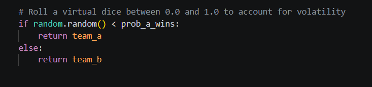
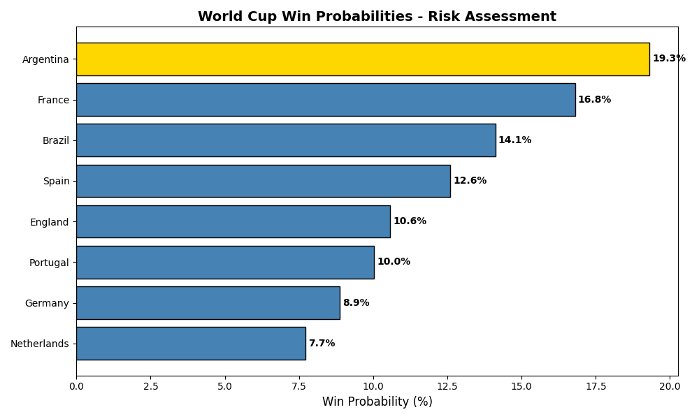
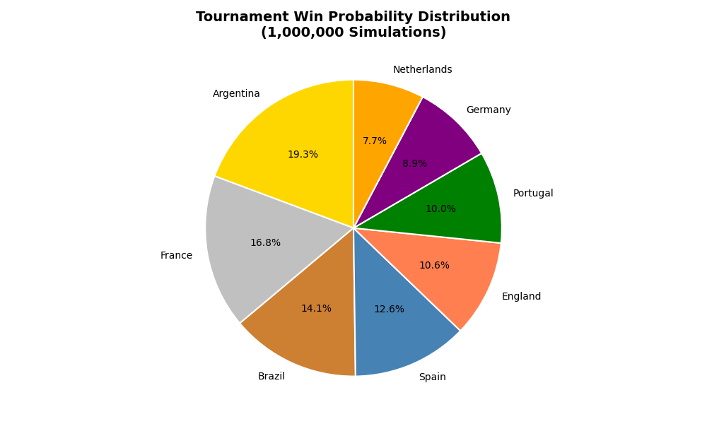

# risk-adjusted-football
A stochastic risk-assessment model forecasting World Cup outcomes through implied probability.

# 🏆 World Cup Monte Carlo: A Study in Risk & Volatility

## 💭 Why I Built This

I spend a lot of my time focused on financial modeling, options pricing, and risk metrics. I wanted to build a project that applied those exact same quantitative principles to a completely different—and arguably more chaotic—environment: the FIFA World Cup.

I wanted to see if I could build a stochastic engine that doesn't just guess a winner, but accurately maps out the underlying probability distribution of a highly volatile tournament.

---

## ⚙️ The "Aha" Moment: Why Use a Dice Roll?

When I first started writing the core logic, I used historical Elo ratings to calculate expected win probabilities (e.g., Argentina having a 61% chance to beat the Netherlands).

Initially, I thought about just letting the higher probability win every time. Adding a random "dice roll" into the code using Python's `random` library honestly felt like a gimmick at first. Why introduce randomness to hard math?

But then it clicked: **the dice roll is the volatility.**



If the better team wins 100% of the time, that's a deterministic model, which is a terrible representation of reality. In finance, you have market shocks; in football, you have injuries, bad referee calls, and lucky bounces. By calculating the expected win probability (the trend) and rolling a virtual dice against it (the volatility), I was able to mathematically replicate upset potential.

---

## 📈 Stress Testing: Pushing It to 1,000,000 Runs

A single simulation with a dice roll is just a guess. To find the real signal in the noise, I had to aggregate the variance.

I initially ran the tournament bracket 10,000 times. It worked beautifully, but I noticed a tiny fraction of statistical noise still existed between runs. I wanted to really stress-test the engine and force it to find the absolute mathematical truth.

So, I cranked the engine up to **1,000,000 iterations**.

Forcing the CPU to calculate millions of chaotic match outcomes completely obliterated the remaining variance. The model converged perfectly, demonstrating the Law of Large Numbers in real time.

### The Final Output (1M Iterations)

*Even though Argentina is the heavy favorite, the model proves that surviving a knockout gauntlet is incredibly risky.*

```text
--- TOURNAMENT WIN PROBABILITIES ---
Argentina    : 19.3%
France       : 16.6%
Brazil       : 14.2%
Spain        : 12.6%
England      : 10.6%
Portugal     : 10.0%
Germany      :  8.9%
Netherlands  :  7.7%
```

---

## 📊 Visualizations

### Risk Assessment — Horizontal View


Reading this like a risk chart — the gap between Argentina (19.3%) and Netherlands (7.7%) is only 11.6 percentage points across 8 teams. In financial terms, this is a relatively flat volatility surface. No single team dominates the distribution enough to be considered a true "safe bet."

---

### Tournament Probability Distribution


The pie chart reveals something important — the top 4 teams (Argentina, France, Brazil, Spain) collectively control only 62.8% of the probability space. The bottom 4 teams still hold a combined 37.2% chance. This is what makes knockout tournaments so unpredictable and so interesting to model.

---

## 🗂️ Project Structure

```
Risk-Adjusted-Football/
├── world_cup.py
├── visualizations.py
├── README.md
└── Visuals/
    ├── image_1.png
    ├── image_2.png
    ├── Figure_1.png
    ├── Figure_2.png
    └── Figure_3.png
```

---

## 🛠️ Technologies Used

- Python 3
- Random (Monte Carlo simulation)
- Matplotlib — data visualization

---

*Built at the intersection of financial risk modeling and sports analytics.*
